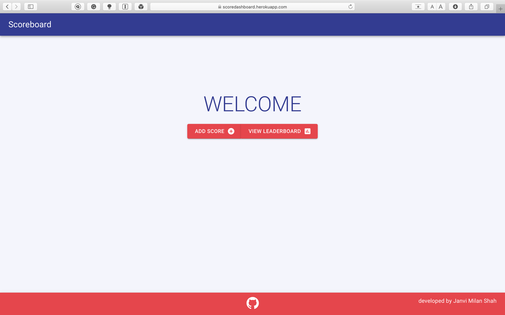
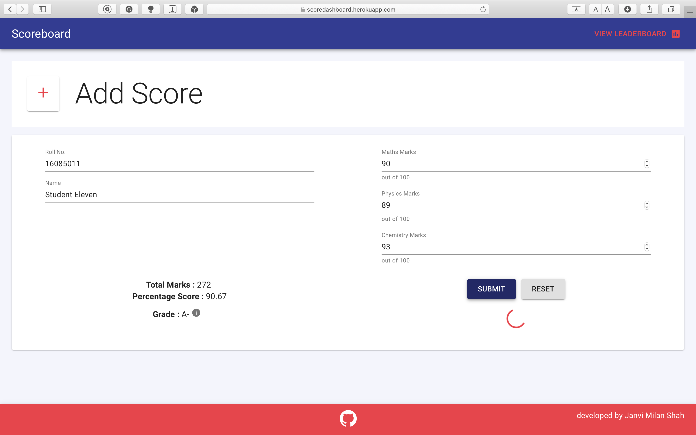
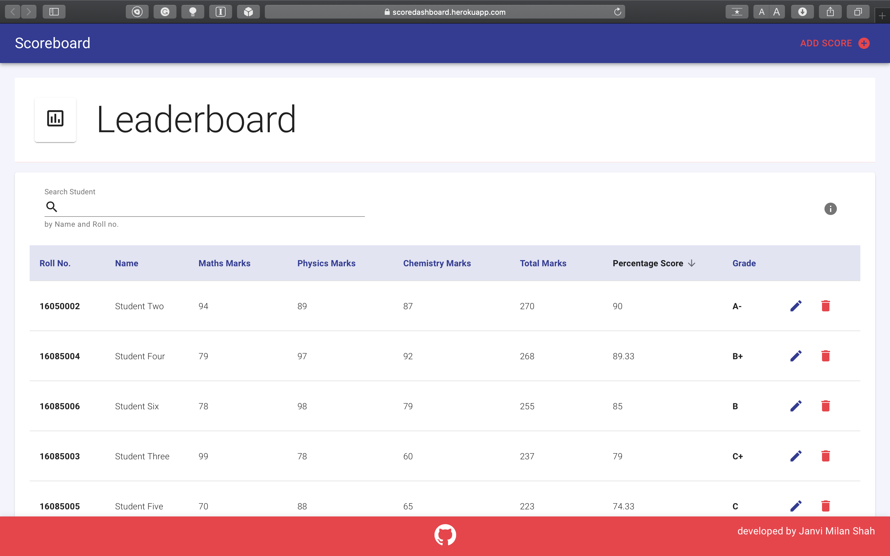
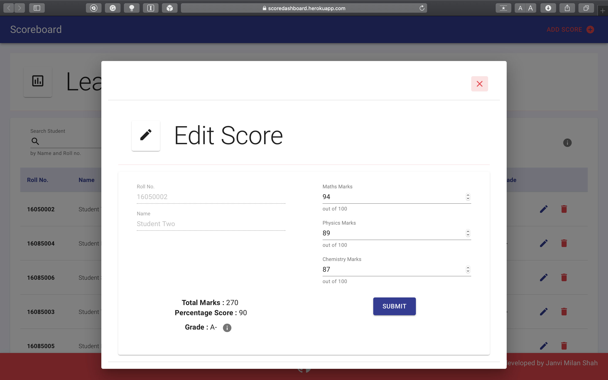
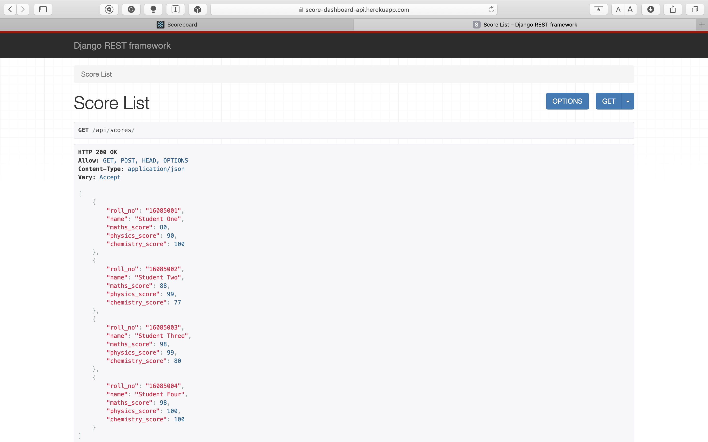

# Score Dashboard

This is an application where user can **add, edit, delete** scores of students and see leaderboard based upon their performances. It consists of both, frontend application and backend server. Frontend is **React Application** while backend is **Django Rest API** (Django and Django Rest Framework). Both, client application and backend server have been deployed on following addresses :

* [React Application](https://scoredashboard.herokuapp.com)
* [Django API](https://score-dashboard-api.herokuapp.com/api/scores/)

An application consists of

1. Home Page with 2 choices, Add Score and View Leaderboard, to navigate to respective pages.
2. Add Score page where user can add user performance and will get confirmation/failure notification on submission.
3. Leaderboard page where students are sorted based upon percentage they have scored.

## Particular Points :

* Django api is connected to MySQL database with Score table in it. Score table consists of Roll no., name of student and his/her score in Maths, Physics and Chemistry. Total marks, Percentage and Grade is not stored in database to avoid data redundancy.
* Django api is allowed to only to accept requests from above react application (allowed origins for CORS policy)
* Both frontend and backend applications have been deployed on heroku. Frontend application has been configured to handle development and production environments to call respective rest endpoints in that environment.
* Api responses have been handled properly so as to display notifications on success or failure.

## Key Features :

* Usage of Material UI for better user experience.
* All 4 CRUD functionalities.
* Input validation on add score form
    - Roll No. needs to be numeric string with 8 characters.
    - Marks input should be numeric and between 0 and 100 inclusive.
* Sorting based upon score of any particular subject, roll no. and name of student.
* Searching feature where user can search student based upon his/her roll no. or name.
* Success or failure notifications based upon api response.
* Edit score form in separate dialog box.
* Client side pagination.
* Grading system to get grade based upon percentage score.
* Page Not Found Page for invalid url.
* Progress spinner.

## Screenshots :

#### Home Page

#### Add Score Form

#### Leaderboard Page

#### Edit Score Form

#### Django Rest Framework UI

